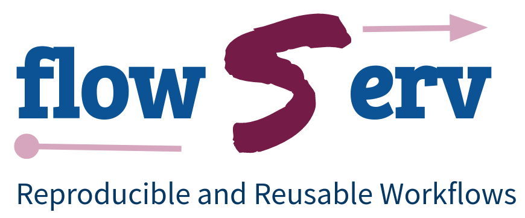
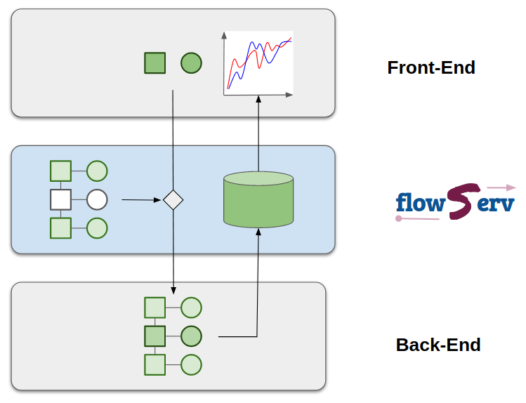

.. Workflow Templates for Reproducible for Data Analysis Benchmarks documentation master file, created by
   sphinx-quickstart on Fri Jun 21 10:32:15 2019.
   You can adapt this file completely to your liking, but it should at least
   contain the root `toctree` directive.

Welcome to the Reproducible and Reusable Data Analysis Workflow Server's documentation!
=======================================================================================

This repository contains the implementation of the core infrastructure for the *Reproducible and Reusable Data Analysis Workflow Server* (*flowServ*). This is an experimental prototype to support reuse and evaluation of published data analysis pipelines as well as community benchmarks of data analysis algorithms. *flowServ* is not yet-another workflow engine. The aim instead is to provide a layer between a client (e.g. a Web user interface) and a workflow engine to facilitate the execution of a defined workflow templates (as shown in the figure below). *flowServ* is designed to be independent of the underlying workflow engine.

Workflow templates contain placeholders for workflow steps and/or input data and parameters that are provided by the user (e.g., by providing Docker containers that satisfy the workflow steps or uploading input data files). *flowServ* triggers and monitors the execution of the workflow for the given input values and maintains the workflow results. The API provides the functionality to submit new workflow runs and to retrieve the evaluation results of completed workflow runs.

*flowServ* was motivated by the `Reproducible Open Benchmarks for Data Analysis Platform (ROB) <https://github.com/scailfin/rob-ui>`_.  The goal of ROB is to allow user communities to evaluate the performance of their different data analysis algorithms in a controlled competition-style format. In ROB, the benchmark coordinator defines the workflow template along with input data. Benchmark participants provide their own implementation of the variable workfow steps. The workflow engine processes workflows on submission. Execution results are maintained by *flowServ* in an internal database. The goal of *flowServ* is to be a more generic platform that can not only be used for benchmarks but also for other types of data analysis workflows.

.. toctree::
   :maxdepth: 2
   :caption: Contents:

   source/workflow
   source/parameters
   source/postproc
   source/packaging
   source/configuration
   source/api

.. _api-ref:

..  toctree::
    :maxdepth: 1
    :caption: API Reference:

    source/api/modules
