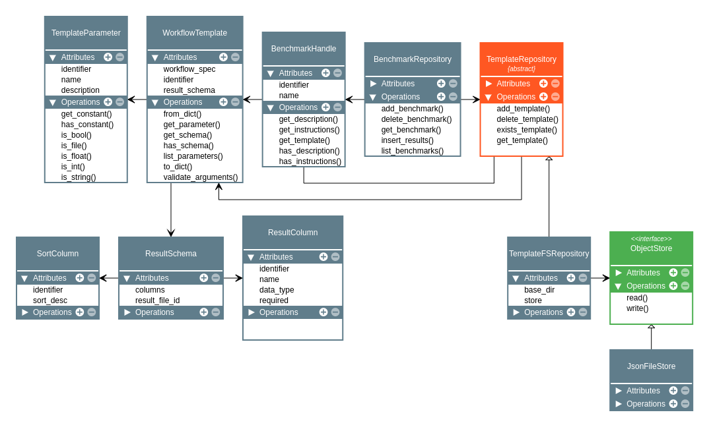

===================================
Repositories for Workflow Templates
===================================

The package contains a default implementation for a repository to maintain workflow templates. The repository stores all the relevant information and files in separate directories on the file system.

Directory Structure
===================

The **Template Repository** is used to maintain copies of workflow templates in a uniform way. All templates are maintained as files on the file system under a base directory. The respective directory structure is as follows:

.. line-block::

    /workflows/                  : Base directory
        {workflow_id}            : Folder for individual workflow
            groups/              : Folder for workflow groups
                {group_id}       : Folder for individual group
                    files/       : Uploaded files for workflow group
                        {file_id}: Folder for uploaded file
                    runs/        : Workflow runs that are associated with the group
                        {run_id} : Individual run folder
            postruns/            : Folder for runs of post-processing workflow
                {run_id}         : Result files for individual post-processing runs
            static/              : Folder for static template files

Each template is assigned a unique identifier. The identifier is used as the directory name for all information related to to template. For each workflow template static files are stored in a sub-directory ``static``. The template specification is maintained (in Json format) in a file called ``template.json``.

When the template is added to the repository, either a source directory on the file system or the URL of a Git repository is expected. If a repository URL is given, the repository will be cloned into a local source directory. The repository will create a new sub-directory for the template using an automatically generated unique identifier. The repository expects a file containing the template specification in the given source. By default, the repository will look for a file with one of the following names (in this order):

.. line-block::

    benchmark.json
    benchmark.yaml
    benchmark.yml
    template.json
    template.yaml
    template.yml
    workflow.json
    workflow.yaml
    workflow.yml

The first matching file is expected to contain the template specification. The suffix determines the expected file format (``.yml`` and ``.yaml`` for files in Yaml format and ``'json`` for Json format). If a specification file is found, the content is stored as ``repository.json`` in the template folder. All files in the source directory are (recursively) copied to the ``static`` folder.

Database
========

The **Template Repository** maintains additional information about templates and benchmark runs in a relational database. The database schema has two tables **benchmark** and **benchmark_runs**:

.. code-block:: sql

    --
    -- Each template has a unique identifier and name, a short descriptor and a
    -- set of instructions.
    --
    CREATE TABLE template(
        id CHAR(32) NOT NULL,
        name VARCHAR(255) NOT NULL,
        description TEXT,
        instructions TEXT,
        PRIMARY KEY(id),
        UNIQUE(name)
    );

    --
    -- For each benchmark run the run state is maintained as well as timestamps
    -- for different stages of the executed workflow.
    --
    CREATE TABLE benchmark_run(
        run_id CHAR(32) NOT NULL,
        submission_id CHAR(32) NOT NULL REFERENCES benchmark_submission (submission_id),
        state VARCHAR(8) NOT NULL,
        created_at CHAR(26) NOT NULL,
        started_at CHAR(26),
        ended_at CHAR(26),
        arguments TEXT NOT NULL,
        PRIMARY KEY(run_id)
    );

For each template the unique identifier and name are maintained, together with an optional short description and a list of instructions for participants. The template name is used as the human-readable identifier and is therefore expected to be unique.

Each benchmark runs has a unique identifier and references the respective template. For benchmark runs various timestamps are maintained (all in UTC time). The ``created_at`` timestamp denotes the time when the run was submitted. The ``started_at`` timestamp is the time when the corresponding workflow engine started the execution of the run. The ``ended_at`` timestamp denotes the time when the workflow terminated. Depending on the ``state``, this timestamp may either be the time of successful completion or the occurrence of an error or an event that canceled workflow execution.

By default, SQLite is used as the database management system. The default database file is ``repo.db`` in the base directory of the repository.

UML Diagram
===========

The UML diagram for the relevant classes is shown below:

UML Diagram of classes that are relevant for workflow template and benchmark repositories.
